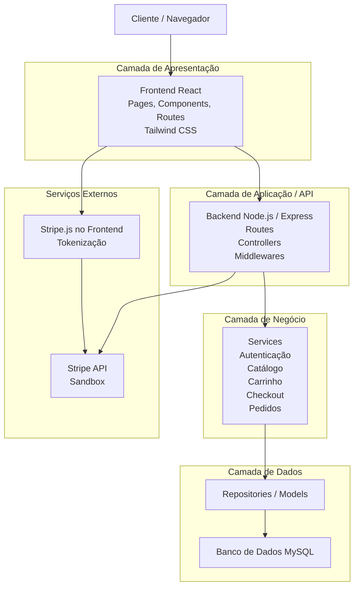

# Diagrama de Arquitetura em Camadas - ESSENCE

## Leitura rápida

- O cliente interage com o `Frontend React`.
- O frontend consome a `API em Node.js/Express`.
- A API delega as regras para a `camada de negócio`.
- A camada de negócio acessa a `camada de dados`, que persiste no `MySQL`.
- No pagamento, o cartão é tokenizado pelo `Stripe.js` no frontend e o backend conversa com a `Stripe API` usando o token seguro.
